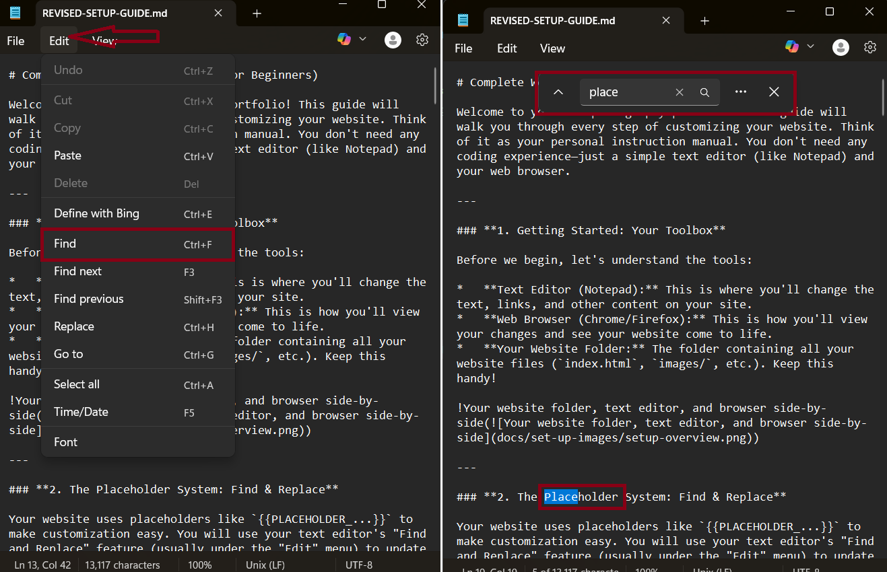
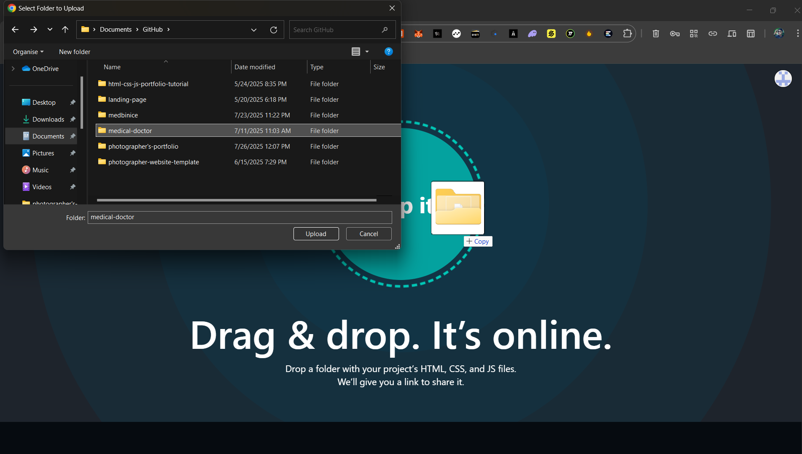

# Complete Website Setup Guide (for Beginners)

Welcome to your new photography portfolio! This guide will walk you through every step of customizing your website. Think of it as your personal instruction manual. You don't need any coding experience—just a simple text editor (like Notepad) and your web browser.

---

### **1. Getting Started: Your Toolbox**

Before we begin, let's understand the tools:

*   **Text Editor (Notepad):** This is where you'll change the text, links, and other content on your site.
*   **Web Browser (Chrome/Firefox):** This is how you'll view your changes and see your website come to life.
*   **Your Website Folder:** The folder containing all your website files (`index.html`, `images/`, etc.). Keep this handy!

!Your website folder, text editor, and browser side-by-side()

---

### **2. The Placeholder System: Find & Replace**

Your website uses placeholders like `{{PLACEHOLDER_...}}` to make customization easy. You will use your text editor's "Find and Replace" feature (usually under the "Edit" menu) to update them.

!Find and Replace feature in a text editor()

#### **Main Page (`index.html`)**

| Placeholder | What It Controls | Location | Example Replacement |
|---|---|---|---|
| `{{PLACEHOLDER_PAGE_TITLE}}` | The text in the browser tab. | Line 11 | "Anna's Photography Portfolio" |
| `{{PLACEHOLDER_META_DESCRIPTION}}` | The site description for Google search results. | Line 14 | "Professional wedding and portrait photographer based in New York." |
| `{{PLACEHOLDER_OG_IMAGE_URL}}` | The image shown when you share a link on Facebook or LinkedIn. | Line 21 | `https://yourwebsite.com/images/social-share-image.jpg` |
| `{{PLACEHOLDER_HERO_TITLE}}` | The main headline on the homepage. | Line 52 | "Creating Timeless Memories" |
| `{{PLACEHOLDER_HERO_SUBTITLE}}` | The smaller text under the main headline. | Line 56 | "Fine Art Wedding Photography" |
| `{{PLACEHOLDER_FOOTER_TEXT}}` | The copyright text at the bottom of every page. | Line 686 | "© 2025 Anna's Photography" |

!Example of replacing a placeholder in `index.html`()

---

### **3. Gallery Setup (`gallery.js`)**

Let's get your photos showing up in the gallery. This is all controlled by a single file: `gallery.js`.

#### **Folder Structure**

First, organize your images like this inside your main website folder. This is very important!

!Diagram of the gallery image file structure
```
your-website-folder/
└── images/
    ├── wedding/
    │   ├── 1.webp
    │   ├── 2.webp
    │   └── ...
    ├── event/
    │   ├── 1.webp
    │   └── ...
    └── indoor/
        ├── 1.webp
        └── ...
```

#### **Configuration**

Now, open `gallery.js` in your text editor.

1.  **Set Image Path (Line 15):**
    *   **Placeholder:** `{{PLACEHOLDER_IMAGE_BASE_PATH}}`
    *   **What it is:** This is like the main address for all your gallery photos.
    *   **How to change:** Replace it with the path to your images folder, which is `'images/'`.

2.  **Set Image Description (Line 16):**
    *   **Placeholder:** `{{PLACEHOLDER_IMAGE_ALT_PREFIX}}`
    *   **What it is:** A short description for all your gallery images that helps with search engines.
    *   **How to change:** Replace it with a prefix like `"A photo from a wedding: "`.

3.  **Set Default Album (Line 50):**
    *   **Placeholder:** `{{PLACEHOLDER_DEFAULT_GALLERY_CATEGORY}}`
    *   **What it is:** The photo album that shows up first when someone visits your gallery page.
    *   **How to change:** Replace it with the name of one of your image folders (e.g., `'wedding'`).

!The `gallery.js` file with the three placeholders highlighted()
---

### **4. Lazy Loading: For a Faster Website**

Your site uses "lazy loading" to make it load faster. It's like putting a "load later" sticker on your images so they only appear when a visitor scrolls to them.

1.  **Add the "Sticker":** When you add new images to your gallery in `gallery.html`, make sure each `` tag has `class="lazy-image"` inside it.
2.  **The "Helper":** The file `lazyloading.js` does all the work automatically. You don't need to edit it, but just know it's there to help.
3.  **⚠ Broken Image Warning:** Computers are picky about names. If an image is named `Wedding.webp`, but you link to `wedding.webp` (lowercase "w"), it won't work. **Always double-check that your folder and file names match exactly.**

**Before Lazy Loading (Example):**
!A page loading all images at once, causing a delay.()

**After Lazy Loading (Example):**
!A page where images appear smoothly as the user scrolls down.()

---

### **5. Animation & Effects Setup**

Your website has animations that make it feel alive.

1.  **Waking Up the Animations (`index.html`, Line 1251):** The line `AOS.init();` "wakes up" the animation library. You don't need to touch this, but it's good to know it's there.
    !The AOS.init() line in index.html()

#### **Animation Configuration (Section 5)**
*   **Scroll Trigger Adjustments:**
    > "Modify threshold: 0.1 in script.js (line 122) - higher numbers = later animations"
    > "Adjust rootMargin: '0px 0px -50px 0px' (line 123) to change trigger points"
    !ScrollTrigger settings in script.js()
---

### **6. Video Backgrounds & Players (`index.html`)**

You can add videos to your site. The template is ready for 7 videos.

| Placeholder | What It Controls | Location | Example Replacement |
|---|---|---|---|
| `{{PLACEHOLDER_VIDEO_MP4_1}}` | Main background video (MP4 format) | Line 55 | `/videos/hero-bg.mp4` |
| `{{PLACEHOLDER_VIDEO_WEBM_1}}` | Main background video (WebM format for better performance) | Line 56 | `/videos/hero-bg.webm` |
| `{{PLACEHOLDER_VIDEO_POSTER_1}}` | The image shown before the video plays | Line 57 | `/images/video-poster-1.jpg` |
| `{{PLACEHOLDER_VIDEO_MP4_2}}` | A second video section (MP4) | Line 250 | `/videos/promo-video.mp4` |
| `{{PLACEHOLDER_VIDEO_WEBM_2}}` | A second video section (WebM) | Line 251 | `/videos/promo-video.webm` |
| `{{PLACEHOLDER_VIDEO_POSTER_2}}` | Poster for the second video | Line 252 | `/images/video-poster-2.jpg` |
| `{{PLACEHOLDER_VIDEO_YOUTUBE_ID}}` | An embedded YouTube video | Line 350 | `dQw4w9WgXcQ` |

!The video section in `index.html` with placeholders()

---

### **7. Contact Form: Getting Messages (`index.html`)**

Your contact form uses a free service called [FormSubmit.co](https://formsubmit.co/).

**Analogy:** Think of FormSubmit as a digital mailbox. When a visitor sends a message, it goes to your FormSubmit mailbox, which then forwards it to your real email address.

1.  **Connect Your Email:**
    *   Find the `<form>` tag in `index.html` (around line 658).
    *   Change the `action` attribute to `https://formsubmit.co/your@email.com`, replacing `your@email.com` with your actual email address.
    !The FormSubmit URL in the form tag()

2.  **Advanced Setup (Optional but Recommended):**
    *   **Stop Spam:** Add this line inside your form to prevent robots from sending you junk mail: `<input type="hidden" name="_captcha" value="false">`. (Set to `"true"` to enable a CAPTCHA).
    *   **Auto-Reply:** Add this line to customize the automatic email your visitors get: `<input type="hidden" name="_autoresponse" value="Thanks for your message! I'll reply soon.">`.
    !The _captcha and _autoresponse fields in the form()

3.  **Testing:** After uploading your site, send a test message from your contact form to make sure it's working!

4.  **⚠ Security Warning:** Some services use "API Keys," which are like special passwords. **Never put secret API keys directly in your `index.html` or `.js` files.** We'll cover the safe way to do this in the "Deployment" section.

#### **FormSubmit Security Upgrade (Optional but Recommended)**

After you've connected your email and sent your first test message, FormSubmit will send you an activation email. This email contains a link to your **Submissions Inbox**, which acts as your dashboard.

*   **Protect Your Email:**
    > 1. In your FormSubmit activation email.
    > 2. In the email, find your unique "encrypted ID".
    > 3. Replace your email in the form's `action` with this ID.
    > 4. **Before:** `action="https://formsubmit.co/your@email.com"`
    > 5. **After:** `action="https://formsubmit.co/12ab34cd56ef789..."`
    !FormSubmit encrypted endpoint settings()

---

### **8. Google Maps (`index.html` & `gallery.html`)**

1.  **Embed Your Map:**
    *   Go to [Google Maps](https://www.google.com/maps), find your address, and click "Share" > "Embed a map".
    *   Copy the HTML code it gives you.
        !Google Maps "Embed a map" screen()
    *   Paste this code into `gallery.html` (line 231) and `index.html` (line 1204), replacing the placeholder comment.

---


### **9. Testimonials: Showcasing Client Love (`index.html`)**

Here’s how to update the 15 client testimonials. You'll repeat this process for each one.

#### **Testimonial 1**
*   **File:** `index.html` (around line 712)
*   **Image:** Find `{{PLACEHOLDER_TESTIMONIAL_IMG_1}}` and replace it with the path to the client's photo (e.g., `/images/testimonials/john.jpg`).
*   **Quote:** Find `{{PLACEHOLDER_TESTIMONIAL_STATEMENT_1}}` and replace it with their quote (e.g., "The best photographer we could have asked for!").
*   **Name:** Find `{{PLACEHOLDER_TESTIMONIAL_NAME_1}}` and replace it with their name.
*   **Service:** Find `{{PLACEHOLDER_TESTIMONIAL_SERVICE_1}}` and replace it with the service you provided.

!The code block for the first testimonial highlighted()

*...Repeat this process for Testimonial 2 (line 736), Testimonial 3 (line 760), and so on for all 15.*

#### **Testimonial Batch Processing (Section 9)**
*   ***Pro Tip:* Use Find/Replace (Ctrl+H) (or Cmd+Option+F on Mac) to update all testimonials:**
    > 1. Find: `{{PLACEHOLDER_TESTIMONIAL_IMG_1}}`
    > 2. Replace with: `/images/testimonials/client1.jpg`
    > 3. Click 'Replace All'
    !Batch replacement in text editor()
---

### **10. Mobile Menu (`script.js`)**

The "hamburger" menu for phones and tablets is controlled by `script.js` (lines 1-51). You generally don't need to edit this code.

*   **Troubleshooting:** If you find the menu isn't closing when you click a link, it's likely an issue in this part of the code. Double-check that no changes were made to it by accident.
!The mobile menu JavaScript code block()

#### **Mobile Menu Troubleshooting (Section 10)**
*   ***Fix Menu Not Closing:***
    > 1. Open script.js
    > 2. Check line 25: `document.querySelectorAll('.nav-list a')`
    > 3. Ensure this matches your menu's CSS class
    !Mobile menu selector in DevTools()
---

### **11. Deployment: Putting Your Website Online!**

"Deploying" is just a fancy word for uploading your website folder to the internet.

#### **Using Netlify (Recommended for Beginners)**

1.  Sign up for a free [Netlify](https://www.netlify.com/) account.
2.  Drag your entire website folder and drop it into the Netlify dashboard. That's it!
    !Dragging a folder into the Netlify "Sites" page()
3.  **For API Keys:** Use Netlify's "Environment Variables" to store your Google Maps API key safely. This keeps it out of your public code.
    !Netlify's Environment Variables settings()

#### **Using GitHub Pages**

1.  Upload your folder to a [GitHub](https://github.com/) repository.
2.  Go to the repository's "Settings" > "Pages" and enable it for your `main` branch.
    !GitHub Pages settings screen()
3.  **Image Slider Fix:** The image slider (Swiper.js) might need a little help. You may need to edit the `swiper-bundle.min.js` link to point to a public version if it doesn't work.
4.  **404 Error Fix:** Create a copy of `index.html` and name it `404.html`. This is a trick that helps GitHub Pages handle direct links to your other pages (like `/gallery`).

**⚠ Final Warning:** Never edit files in folders like `js/libs/` or `css/libs/`. These are external libraries, and changing them can break your site. If something goes wrong, it's best to re-download a fresh copy of the template.
